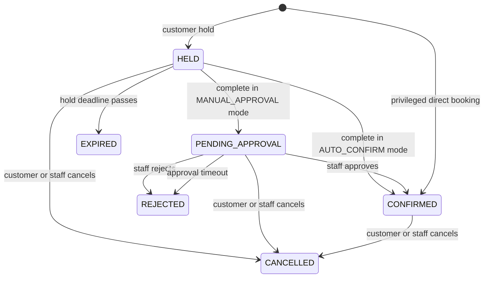

# Reservation Lifecycle

## Status model

The reservation lifecycle statuses are:

- `HELD`
- `PENDING_APPROVAL`
- `CONFIRMED`
- `REJECTED`
- `CANCELLED`
- `EXPIRED`

The legacy `BOOKED` status is removed.



`REJECTED`, `CANCELLED`, and `EXPIRED` are terminal. Repeating a command with the same idempotency key returns its original result.

## Actors and transitions

| Command | From | To | Allowed actor | Notes |
|---|---|---|---|---|
| Create hold | none | `HELD` | Customer | One active hold per customer per organization. |
| Complete | `HELD` | `CONFIRMED` | Owner/application flow | Automatic confirmation mode. |
| Complete | `HELD` | `PENDING_APPROVAL` | Owner/application flow | Manual approval mode. |
| Approve | `PENDING_APPROVAL` | `CONFIRMED` | Staff/Admin | Requires idempotency key. |
| Reject | `PENDING_APPROVAL` | `REJECTED` | Staff/Admin | Requires structured reason. |
| Cancel | active status | `CANCELLED` | Owner before cutoff, Staff/Admin at any time | Privileged post-start corrections require a reason; refund consequences remain outside reservation. |
| Direct booking | none | `CONFIRMED` | Staff/Admin | May target a user or guest; no hold or approval. |

## Reservation ownership

Reservations store:

- `reservedForType`: `USER` or `GUEST`
- `reservedForId`: opaque internal user ID or external guest ID
- `createdByUserId`: authenticated actor

Customer commands derive the owner from authentication. Only staff/admins may supply another registered user or guest reference.

## Privileged booking rules

Staff/admin direct bookings may bypass hold, approval, minimum notice, maximum advance window, and customer cancellation cutoff. They may not bypass activation, allowed sport/duration, schedules, blocks, overlap protection, or the prohibition on booking in the past.

## Policy outcomes are preserved

Organization policies apply to new holds. Store derived outcomes on each reservation:

- confirmation mode
- `holdExpiresAt`
- `approvalDeadline`
- `cancellationDeadline`
- venue zone ID used at creation

Later policy changes are not retroactive.

## Expiration

Expiration is timestamp-driven:

- A held interval blocks only while `holdExpiresAt` is in the future.
- A pending approval blocks only until its approval deadline.
- Conflict queries apply deadlines directly, so delayed cleanup cannot keep a slot blocked.
- A background job eventually records `EXPIRED` or timeout rejection and appends transition history.

Use an injectable clock in application code and deterministic clocks in tests. Production queries that decide whether a row blocks should use a consistent database/application time strategy.

## Cancellation and rejection reasons

Platform-defined reason codes are stable strings stored with the transition. Staff rejection/cancellation requires a reason code; notes are optional and privileged by default. Reason codes are not organization-configurable.

## Transition history

Never hard-delete reservations. Append a transition record with:

```text
reservationId
fromStatus
toStatus
reasonCode
note
changedBy
changedAt
correlationId
```

## Attendance outcome

Attendance is independent of lifecycle status:

- `UNRECORDED`
- `ATTENDED`
- `NO_SHOW`

After `endsAt`, staff/admins can record or correct attendance with a reason. Corrections are audited. Customer ratings and self-reported attendance are not in the MVP.
